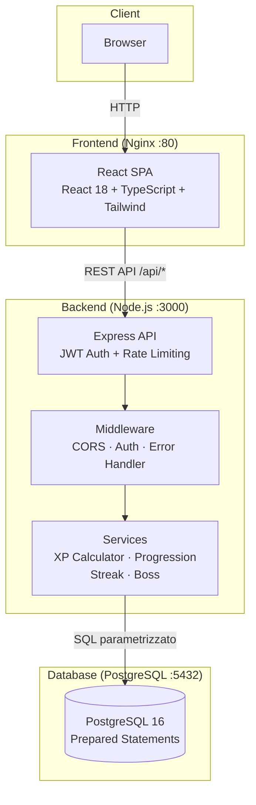
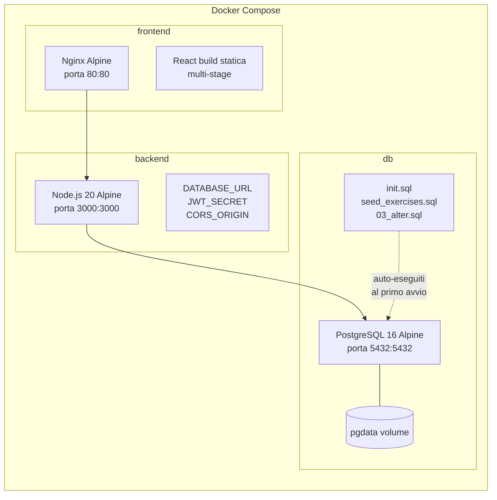
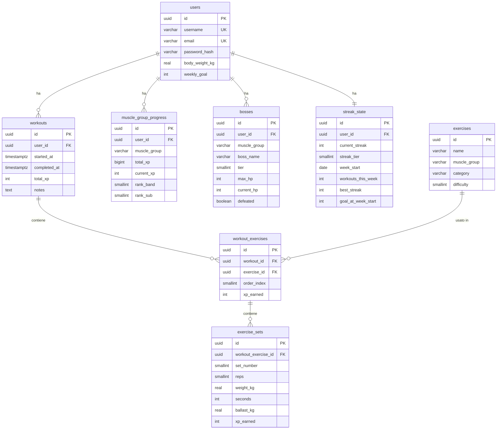
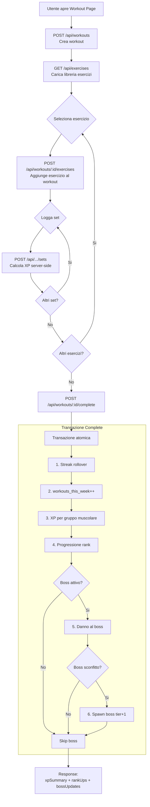
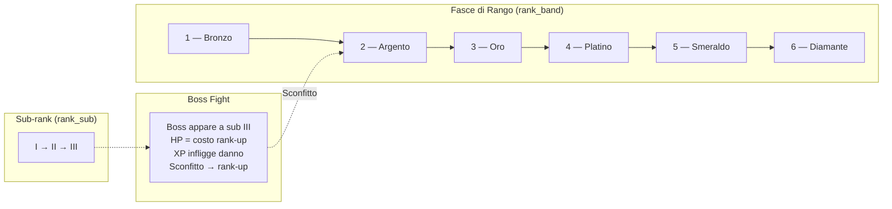
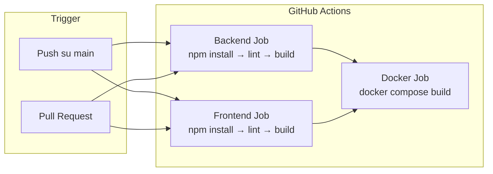

# FitQuest Web — Architettura

## 1. Architettura Three-Tier

## 2. Deployment Docker Compose

## 3. Schema ER (semplificato)

## 4. Flusso Workout

## 5. Sistema di Progressione

## 6. Pipeline CI/CD

